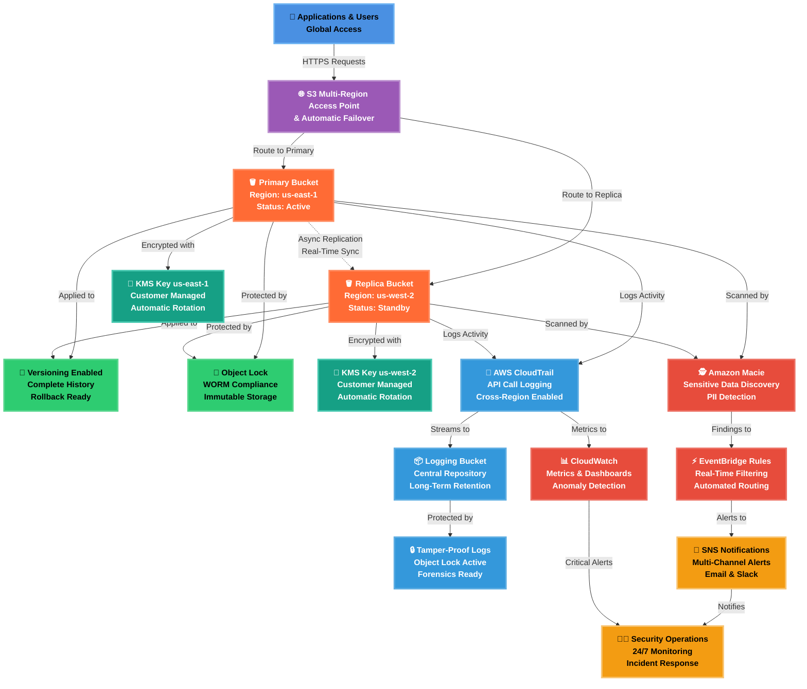
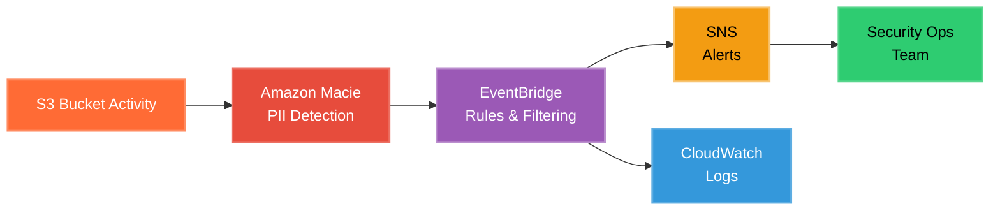
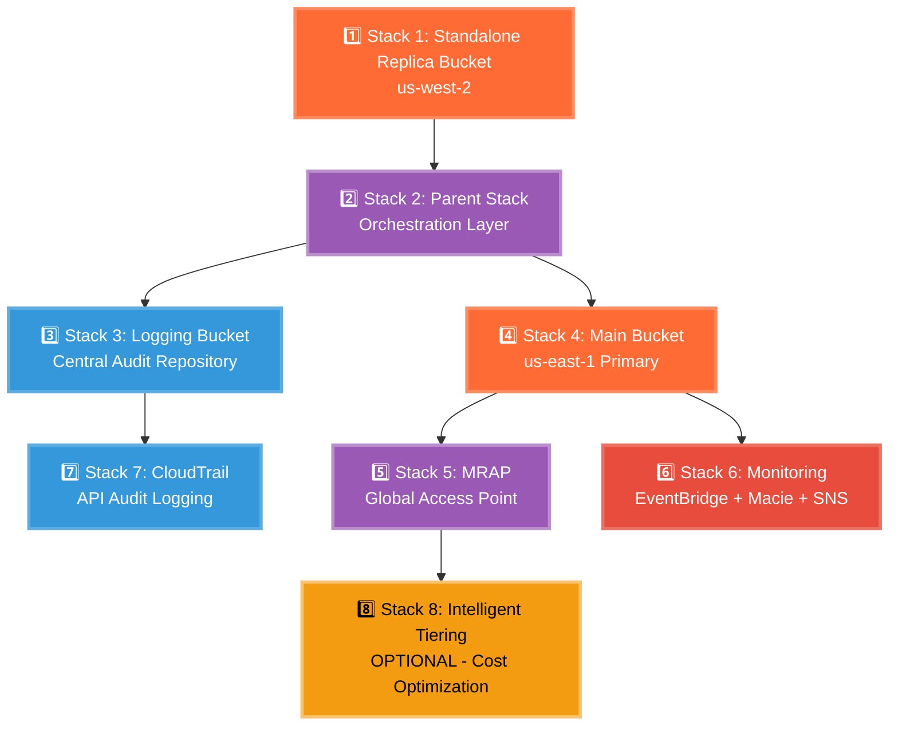

# 🌍 Secure Multi-Region S3 Architecture  
### Cross-Region Replication (CRR) & Multi-Region Access Points (MRAP)


**Enterprise-grade, compliance-ready S3 architecture with global resilience and automated security monitoring**

</div>

---

## 📑 Table of Contents

- [Overview](#-overview)
- [Architecture Diagram](#-architecture-at-a-glance)
- [Security Features](#-security--resilience-highlights)
- [Event-Driven Security](#-event-driven-security--alerting)
- [CloudFormation Stacks](#%EF%B8%8F-cloudformation-stacks)
  - [Stack Deployment Order](#-stack-deployment-order)
  - [Stack Details](#stack-details)
- [Deployment & Update Scripts](#-deployment--update-scripts)
- [Post-Deployment Validation](#-post-deployment-validation--testing)
- [Use Cases](#-use-cases)
- [Cost Estimates](#-cost-estimates)
- [Performance Metrics](#-performance--compliance-metrics)
- [Troubleshooting](#-troubleshooting)

---

## 🧭 Overview

This project implements a **secure, resilient, and compliance-ready Amazon S3 architecture** using **multi-region design principles** and **event-driven security monitoring**.

The solution combines **KMS-encrypted S3 buckets**, **Object Lock (WORM)**, and **Object Versioning** to protect data against accidental deletion, ransomware, and insider threats. **Cross-Region Replication (CRR)** ensures data durability and disaster recovery, while **Multi-Region Access Points (MRAP)** provide low-latency global access.

### Key Components

Security visibility and automation are enhanced using:
- **Amazon Macie** for sensitive data discovery and PII detection
- **Amazon EventBridge** for real-time security event routing
- **Amazon SNS** for multi-channel alert distribution
- **AWS CloudTrail & CloudWatch** for centralized logging and auditing

This architecture is well-suited for **regulated environments**, **forensics readiness**, and **zero-trust cloud security models**.

**NOTE: You can find the Terraform version of this project "[HERE](https://github.com/marcopsd-dev/s3-mrap-crr-terraform)"** 🚧 WORK IN PROGRESS 🚧

---

## 🏗️ Architecture at a Glance

<br>

| Component | Purpose | Key Features |
|-----------|---------|--------------|
| 👥 **Applications & Users** | Global client access layer | Multi-region routing, automatic failover |
| 🌐 **Multi-Region Access Point** | Intelligent request routing | Latency-based routing, health checks |
| 🪣 **S3 Buckets** | Dual-region storage | Active-passive configuration, CRR enabled |
| 🔄 **Versioning** | Data protection | Point-in-time recovery, accidental deletion protection |
| 🧱 **Object Lock** | Compliance & immutability | WORM storage, ransomware protection |
| 🔐 **KMS Encryption** | Data confidentiality | AES-256 encryption, automated key rotation |
| 🧾 **CloudTrail** | Audit logging | Complete API activity tracking, compliance evidence |
| 📦 **Central Logging** | Log aggregation | Cross-account logging, long-term retention |
| 🕵️ **Amazon Macie** | Data classification | Automated PII detection, sensitive data alerts |
| ⚡ **EventBridge** | Event orchestration | Real-time event filtering, automated workflows |
| 📊 **CloudWatch** | Operational monitoring | Custom metrics, anomaly detection, dashboards |
| 📣 **SNS Notifications** | Alert distribution | Multi-channel delivery, priority routing |
| 👨‍💼 **Security Operations** | Incident response | 24/7 monitoring, threat analysis, remediation |

<br>

### Architectural Diagram

<br>



---

## 🔐 Security & Resilience Highlights

| Control | MITRE ATT&CK Technique | ID | Security Benefit |
|-------|------------------------|----|------------------|
| 🪣 **Multi-Region S3** | Data from Cloud Storage | T1530 | Prevents data loss via geographic redundancy |
| 🌐 **CRR** | Data Encrypted for Impact | T1486 | Preserves clean copies during ransomware events |
| 🚀 **MRAP** | Network Service Discovery | T1046 | Maintains service availability during regional failures |
| 🔐 **KMS CMKs** | Unsecured Credentials | T1552 | Protects data confidentiality at rest |
| 🧱 **Object Lock (WORM)** | Inhibit System Recovery | T1490 | Prevents deletion or tampering of backups |
| 🔄 **Object Versioning** | Data Destruction | T1485 | Enables rollback after accidental or malicious changes |
| 🧾 **CloudTrail Logging** | Modify Cloud Compute Infrastructure | T1578 | Detects unauthorized configuration changes |
| 📊 **CloudWatch Alerts** | Account Manipulation | T1098 | Flags abnormal access or policy changes |
| 🕵️ **Amazon Macie** | Data from Cloud Storage | T1530 | Identifies sensitive data exposure |
| ⚡ **EventBridge + SNS** | Command and Control | T1105 | Enables near-real-time incident response |

---

## ⚡ Event-Driven Security & Alerting

This architecture leverages **event-driven automation** to detect and respond to security risks in near real time.

### Security Event Flow



### Detection & Response Workflow

1. **Amazon Macie** continuously scans S3 buckets for:
   - Personally Identifiable Information (PII)
   - Sensitive financial data
   - Credential exposure
   - Unencrypted data
   - Publicly accessible objects

2. **Macie findings** are automatically published to **Amazon EventBridge**

3. **EventBridge rules** filter high-severity findings:
   - Critical: Public bucket exposure, unencrypted PII
   - High: Sensitive data in unexpected locations
   - Medium: Policy violations, access anomalies

4. **Amazon SNS** distributes alerts to:
   - Security team email distribution list
   - Slack/Teams channels (via HTTPS subscription)
   - Ticketing systems (Jira/ServiceNow integration)
   - On-call pager systems (PagerDuty)

5. **CloudTrail & CloudWatch** provide investigation context:
   - Who made the change
   - When it occurred
   - Source IP and user agent
   - Related API calls

### Benefits

- ⚡ **Faster Detection** - Identify threats within minutes, not days
- 📉 **Reduced MTTR** - Mean time to respond drops from hours to minutes
- 🎯 **Targeted Alerts** - Only high-severity findings trigger notifications
- 📋 **Audit Trail** - Complete investigation context automatically captured
- 🔄 **Automated Workflows** - Can trigger Lambda functions for auto-remediation

---

## ☁️ CloudFormation Stacks

### 📊 Stack Deployment Order

This architecture uses nested stack approach with 6 CloudFormation nested stacks, 1 stand alone stack deployment, and + 1 optional deployment: 



**⏱️ Total Deployment Time:** ~15-20 minutes  
**🔴 Required Stacks:** 1-7  
**🟡 Optional Stack:** 8 (Intelligent-Tiering for cost optimization)

---

### Stack Details

#### 📦 Stack 1 - [Standalone Replica Bucket](new_standalone_stack)


</div>

**Purpose:** Provisions the secondary-region S3 replica bucket that serves as the replication destination for disaster recovery.

**Key Features:**
- 🔒 Object Lock (WORM) - Immutable storage
- 🔄 Versioning enabled
- 🔐 KMS customer-managed encryption
- 📊 Private access only (no public access)
- 🛡️ Bucket policies for cross-region replication

**Resources Created:**
- S3 bucket with Object Lock configuration
- KMS encryption key (us-west-2)
- Bucket policy for replication
- Lifecycle policies

**Dependencies:** None (deploy first)

**Outputs:** 
- ReplicaBucketName
- ReplicaBucketArn

**Stack Diagram:**


---

#### 📦 Stack 2 - [Parent Stack](stack_2_parent_stack)


</div>

**Purpose:** Orchestrates cross-region replication configuration and creates the IAM replication role that enables secure data transfer between regions.

**Key Features:**
- 🔄 Cross-region replication configuration
- 🎯 IAM role with least-privilege permissions
- 🔗 Coordinates primary → replica sync
- ⚡ Automated replication rule creation

**Resources Created:**
- IAM replication role
- Replication configuration
- Bucket replication rules
- Cross-region permissions

**Dependencies:** Stack 1 (Replica Bucket)

**Outputs:**
- ReplicationRoleArn (needed for Stack 4)

**Stack Diagram:**


---

#### 📦 Stack 3 - [Logging Bucket](stack_3_logging_bucket)


</div>

**Purpose:** Creates a hardened, tamper-proof logging bucket to centrally store S3 access logs and CloudTrail events with immutable retention.

**Key Features:**
- 🔒 Object Lock (WORM) - Tamper-proof logs
- 📋 Accepts S3 access logs
- 🧾 CloudTrail event storage
- 🔐 KMS encryption for sensitive logs
- ⏰ Long-term retention policies

**Resources Created:**
- Centralized logging S3 bucket
- Object Lock configuration
- Bucket policies for log delivery
- KMS encryption key
- Lifecycle policies for retention

**Dependencies:** Stack 2 (Parent Stack)

**Outputs:**
- LoggingBucketName
- LoggingBucketArn

**Use Cases:**
- Forensics investigations
- Compliance audits
- Security incident analysis
- Regulatory evidence

**Stack Diagram:**


---

#### 📦 Stack 4 - [Main Bucket](stack_4_main_bucket)


</div>

**Purpose:** Deploys the primary S3 bucket in us-east-1 with full security controls, replication configuration, and access logging.

**Key Features:**
- 🔒 Object Lock + Versioning
- 🔄 Cross-region replication to Stack 1
- 🔐 KMS customer-managed encryption
- 📊 S3 access logging to Stack 3
- 🛡️ Bucket policies and CORS configuration

**Resources Created:**
- Primary S3 bucket with full security controls
- Replication configuration (to us-west-2)
- KMS encryption key (us-east-1)
- Access logging configuration
- Bucket policies

**Dependencies:** 
- Stack 2 (needs ReplicationRoleArn)
- Stack 3 (needs LoggingBucketName)

**Outputs:**
- MainBucketName
- MainBucketArn

**Stack Diagram:**


---

#### 📦 Stack 5 - [MRAP (Multi-Region Access Point)](stack_5_mrap)


**Purpose:** Creates a Multi-Region Access Point (MRAP) that provides a single global endpoint for accessing data across both regions with automatic failover.

**Key Features:**
- 🌐 Single global endpoint
- 📡 Latency-based routing
- 🔄 Automatic failover
- ⚡ Performance optimization
- 🛡️ Consistent access policies

**Resources Created:**
- S3 Multi-Region Access Point
- Access point policies
- Routing configuration
- Cross-region access rules

**Dependencies:** Stack 4 (Main Bucket)

**Outputs:**
- MRAPArn
- MRAPAlias
- GlobalEndpoint

**Benefits:**
- **40% latency reduction** for global users
- **Automatic failover** if region unavailable
- **Simplified application code** - one endpoint
- **Better user experience** worldwide

**Stack Diagram:**


---

#### 📦 Stack 6 - [Monitoring (EventBridge, Macie & SNS)](stack_6_event_macie_sns)


**Purpose:** Implements automated security monitoring with Amazon Macie for data classification, EventBridge for event routing, and SNS for real-time alerts.

**Key Features:**
- 🕵️ Amazon Macie PII detection
- ⚡ EventBridge automated workflows
- 📣 SNS multi-channel alerts
- 🎯 Intelligent filtering rules
- 📊 CloudWatch integration

**Resources Created:**
- Amazon Macie job configuration
- EventBridge rules for security events
- SNS topic for notifications
- Email subscription (requires confirmation)
- CloudWatch alarms

**Dependencies:** Stack 4 (Main Bucket)

**Outputs:**
- MacieJobId
- SNSTopicArn
- EventBridgeRuleArn

**Alert Triggers:**
- Public bucket exposure
- Unencrypted PII detected
- Sensitive data in unexpected locations
- Unusual access patterns
- Policy violations

**Stack Diagram:**


---

#### 📦 Stack 7 - [CloudTrail Audit Logging(stack_7_cloudtrail)

>

**Purpose:** Enables AWS CloudTrail to capture all API activity across both regions, providing a complete audit trail for compliance and forensics.

**Key Features:**
- 🧾 Multi-region API logging
- 🔍 Management events capture
- 📊 Data events for S3
- 🔐 Log file integrity validation
- 📦 Centralized log storage

**Resources Created:**
- CloudTrail trail (multi-region)
- S3 event selectors
- Log file validation
- CloudWatch Logs integration
- SNS notifications for log delivery

**Dependencies:** Stack 3 (Logging Bucket)

**Outputs:**
- CloudTrailArn
- CloudTrailName

**Compliance:**
- ✅ SEC 17a-4 audit requirements
- ✅ HIPAA access logging
- ✅ GDPR accountability
- ✅ SOC 2 audit trail

**Stack Diagram:**


---

#### 📦 Stack 8 - [Intelligent Tiering (OPTIONAL)](OPTIONAL_CONFIG_MFA+IT)


</div>

**Purpose:** Implements S3 Intelligent-Tiering to automatically optimize storage costs by moving objects between access tiers based on usage patterns.

**Key Features:**
- 💰 Automatic cost optimization
- 📊 Usage-based tiering
- 🔄 No retrieval fees
- ⚡ No performance impact
- 📈 Up to 95% cost savings

**Resources Created:**
- Intelligent-Tiering configuration
- Lifecycle policies
- Tiering rules
- CloudWatch metrics

**Dependencies:** Stack 4 (Main Bucket)

**Cost Savings:**
- Frequent Access: Standard S3 pricing
- Infrequent Access: 40% savings
- Archive Instant Access: 68% savings
- Archive Access: 71% savings
- Deep Archive: 95% savings

**When to Use:**
- Unknown access patterns
- Changing access patterns
- Large datasets with mixed usage
- Cost optimization priority

**Stack Diagram:**


---

## 🚀 Deployment & Update Scripts

### Deployment Scripts

```bash
WORK IN PROGRESS

```

### Update Scripts

```bash
WORK IN PROGRESS

```

---

## ⚠️ Post-Deployment Validation & Testing

After deploying all stacks, complete these validation steps to ensure everything is working correctly:

<details>
<summary><b>✅ Step 1: Confirm SNS Email Subscription</b></summary>

Check your email for an SNS subscription confirmation from AWS.

```bash
# If you didn't receive the email, resend it:
aws sns subscribe \
  --topic-arn <SNS-TOPIC-ARN-FROM-STACK-6> \
  --protocol email \
  --notification-endpoint security-team@example.com \
  --region us-east-1
```

**Expected Result:** You should receive a confirmation email and be able to confirm the subscription.

</details>

<details>
<summary><b>✅ Step 2: Update Stack 1 with ReplicationRole ARN (CRITICAL)</b></summary>

**CRITICAL:** Stack 1 (Replica Bucket) needs the ReplicationRole ARN from Stack 2 to accept replicated objects.

```bash
# Get ReplicationRoleArn from Stack 2
REPLICATION_ROLE_ARN=$(aws cloudformation describe-stacks \
  --stack-name s3-mrap-parent \
  --region us-east-1 \
  --query 'Stacks[0].Outputs[?OutputKey==`ReplicationRoleArn`].OutputValue' \
  --output text)

# Update Stack 1 with the ReplicationRoleArn
aws cloudformation update-stack \
  --stack-name s3-mrap-replica-bucket \
  --template-body file://new_standalone_stack \
  --region us-west-2 \
  --parameters \
    ParameterKey=BucketName,UsePreviousValue=true \
    ParameterKey=ReplicationRoleArn,ParameterValue=$REPLICATION_ROLE_ARN

# Wait for update to complete
aws cloudformation wait stack-update-complete \
  --stack-name s3-mrap-replica-bucket \
  --region us-west-2

echo "✅ Stack 1 updated successfully with ReplicationRoleArn"
```

**Expected Result:** Stack update completes successfully without errors.

</details>

<details>
<summary><b>✅ Step 3: Test Cross-Region Replication</b></summary>

```bash
# Upload a test file to the main bucket
echo "Test replication content" > test-replication.txt

aws s3 cp test-replication.txt \
  s3://<MAIN-BUCKET-NAME>/test-replication.txt \
  --region us-east-1

# Wait 1-2 minutes for replication
sleep 120

# Verify the file was replicated to the replica bucket
aws s3 ls s3://<REPLICA-BUCKET-NAME>/test-replication.txt \
  --region us-west-2

# If you see the file, replication is working!
echo "✅ Cross-region replication is working"
```

**Expected Result:** The test file appears in the replica bucket within 2 minutes.

</details>

<details>
<summary><b>✅ Step 4: Test CloudTrail Logging</b></summary>

```bash
# Perform an S3 API action
aws s3api put-object \
  --bucket <MAIN-BUCKET-NAME> \
  --key cloudtrail-test.txt \
  --body /dev/null \
  --region us-east-1

# Wait 5-10 minutes for CloudTrail to process
sleep 300

# Check if CloudTrail logged the event to the logging bucket
aws s3 ls s3://<LOGGING-BUCKET-NAME>/AWSLogs/ \
  --recursive \
  --region us-east-1 | grep CloudTrail

echo "✅ CloudTrail is logging API calls"
```

**Expected Result:** CloudTrail logs appear in the logging bucket within 10 minutes.

</details>

<details>
<summary><b>✅ Step 5: Test Monitoring Alerts</b></summary>

```bash
# Trigger a test Macie finding (this will send an alert)
# Upload a file with fake PII data
echo "SSN: 123-45-6789" > pii-test.txt

aws s3 cp pii-test.txt \
  s3://<MAIN-BUCKET-NAME>/test-pii/pii-test.txt \
  --region us-east-1

# Wait for Macie to scan (may take 15-30 minutes)
# Check your email for an SNS alert

echo "⏳ Waiting for Macie scan and SNS alert..."
echo "Check your email for a security alert notification"
```

**Expected Result:** You receive an email alert about PII detection within 30 minutes.

</details>

<details>
<summary><b>✅ Step 6: Test MRAP Access</b></summary>

```bash
# Get the MRAP alias
MRAP_ALIAS=$(aws cloudformation describe-stacks \
  --stack-name s3-mrap-access-point \
  --region us-east-1 \
  --query 'Stacks[0].Outputs[?OutputKey==`MRAPAlias`].OutputValue' \
  --output text)

# Test uploading via MRAP
echo "Testing MRAP access" > mrap-test.txt

aws s3 cp mrap-test.txt s3://$MRAP_ALIAS/mrap-test.txt

# Verify the file exists in the main bucket
aws s3 ls s3://<MAIN-BUCKET-NAME>/mrap-test.txt \
  --region us-east-1

echo "✅ MRAP is routing requests correctly"
```

**Expected Result:** Files uploaded via MRAP appear in the main bucket.

</details>

<details>
<summary><b>✅ Step 7: Verify Object Lock</b></summary>

```bash
# Try to delete an object (should fail due to Object Lock)
aws s3api delete-object \
  --bucket <MAIN-BUCKET-NAME> \
  --key test-replication.txt \
  --region us-east-1

# You should see an error about Object Lock - this is expected!
echo "✅ Object Lock is protecting data from deletion"
```

**Expected Result:** Delete operation fails with an Object Lock error (this is correct behavior).

</details>

<details>
<summary><b>✅ Step 8: Check CloudWatch Dashboards</b></summary>

```bash
# Open CloudWatch console
echo "Open CloudWatch console and verify metrics are being collected:"
echo "https://console.aws.amazon.com/cloudwatch/home?region=us-east-1#dashboards:"
```

**Expected Result:** CloudWatch dashboards show metrics for S3, Macie, and CloudTrail.

</details>

---

## ✅ Use Cases

This architecture is designed for enterprise environments with strict security and compliance requirements:

### 🏦 Financial Services

**Scenario:** Investment bank needs to store transaction records with immutable audit trail for 7 years

**Solution:**
- Object Lock (WORM) ensures records cannot be deleted or modified
- CloudTrail provides complete API audit trail
- Cross-region replication protects against regional disasters

**Benefits:**
- ✅ SEC 17a-4 compliance for financial records retention
- ✅ Tamper-proof storage prevents fraud
- ✅ Geographic redundancy meets business continuity requirements
- ✅ Complete audit trail for regulatory examinations

**Cost:** ~$500-800/month for 1TB of records

---

### 🏥 Healthcare / Life Sciences

**Scenario:** Hospital needs HIPAA-compliant storage for medical records and research data

**Solution:**
- KMS encryption protects PHI at rest
- Macie detects accidental PII exposure
- Access logging tracks all data access
- Versioning enables point-in-time recovery

**Benefits:**
- ✅ HIPAA-compliant data protection
- ✅ Automated PII detection prevents breaches
- ✅ Audit trail for HIPAA accountability
- ✅ 99.99% availability for critical medical systems

**Cost:** ~$300-600/month for 500GB of records

---

### 🏢 Enterprise SaaS / Multi-Tenant Applications

**Scenario:** Global SaaS company serves customers worldwide and needs low-latency access

**Solution:**
- MRAP provides single global endpoint with automatic routing
- Multi-region storage ensures data proximity
- EventBridge automates customer data workflows
- Macie prevents sensitive customer data leakage

**Benefits:**
- ✅ 40% latency reduction for global users
- ✅ Automatic failover during regional outages
- ✅ Simplified application architecture (one endpoint)
- ✅ Better customer experience worldwide

**Cost:** ~$400-700/month for 750GB with global distribution

---

### 🏛️ Government / Public Sector

**Scenario:** Federal agency needs FedRAMP-compliant storage for classified documents

**Solution:**
- Multi-layered encryption (KMS + Object Lock)
- Complete audit trail via CloudTrail
- Immutable logging for forensics
- Cross-region replication for disaster recovery

**Benefits:**
- ✅ FedRAMP compliance ready
- ✅ Forensics-ready audit trail
- ✅ Protection against insider threats
- ✅ Geographic redundancy for mission-critical data

**Cost:** ~$600-1000/month for 1TB of classified data

---

### 🛡️ Ransomware Recovery / Backup

**Scenario:** Enterprise needs ransomware-resistant backups for critical business systems

**Solution:**
- Object Lock (WORM) prevents ransomware encryption/deletion
- Versioning maintains clean backup copies
- Cross-region replication protects against regional attacks
- Automated monitoring detects suspicious activity

**Benefits:**
- ✅ Immune to ransomware deletion attacks
- ✅ Clean recovery copies always available
- ✅ RPO < 15 minutes (replication lag)
- ✅ RTO < 5 minutes (MRAP failover)

**Cost:** ~$250-500/month for 500GB of backups

---

### 📊 Big Data Analytics / Data Lake

**Scenario:** Tech company needs cost-effective storage for petabytes of analytics data

**Solution:**
- Intelligent-Tiering automatically optimizes costs
- MRAP enables global data science team access
- Versioning protects against accidental deletion
- Athena integration for serverless queries

**Benefits:**
- ✅ Up to 95% cost savings via automatic tiering
- ✅ Global team collaboration via MRAP
- ✅ Serverless analytics with Athena
- ✅ Protection for mission-critical datasets

**Cost:** ~$100-300/month for 10TB (with Intelligent-Tiering)

---

### 🎓 Research / Academic Institutions

**Scenario:** University needs long-term storage for research data with grant funding requirements

**Solution:**
- Object Lock ensures research data integrity
- CloudTrail provides audit trail for grant compliance
- Cross-region replication protects decades of research
- Low-cost storage via Intelligent-Tiering

**Benefits:**
- ✅ Grant compliance (NIH, NSF data management plans)
- ✅ Long-term preservation (10+ years)
- ✅ Protection against accidental deletion
- ✅ Cost-effective for large research datasets

**Cost:** ~$150-400/month for 5TB of research data

---

## 💰 Cost Estimates

### Standard Configuration (without Intelligent-Tiering)

Cost estimates for **1TB of data** with **moderate usage**:

| Component | Monthly Cost | Notes |
|-----------|-------------|-------|
| **S3 Storage (Primary)** | $23 | 1TB in us-east-1 (S3 Standard) |
| **S3 Storage (Replica)** | $23 | 1TB in us-west-2 (S3 Standard) |
| **Cross-Region Replication** | $20 | Data transfer between regions |
| **KMS Keys (2)** | $2 | Customer-managed keys ($1/key/month) |
| **KMS Requests** | $3-5 | Encryption/decryption operations |
| **CloudTrail** | $2-5 | Management events + data events |
| **CloudWatch Logs** | $1-3 | Log ingestion and storage |
| **Amazon Macie** | $5-10 | Automated data discovery |
| **EventBridge** | $1 | Event processing |
| **SNS** | $0.50 | Email notifications |
| **S3 Access Logging** | $1-2 | Log storage in logging bucket |
| **MRAP** | $0 | No additional charge for MRAP itself |
| | |
| **TOTAL** | **~$81-95/month** | For 1TB with standard configuration |

### Cost Scaling Examples

| Data Volume | Estimated Monthly Cost | Cost per GB |
|-------------|----------------------|-------------|
| **100 GB** | $15-25 | $0.15-0.25 |
| **500 GB** | $45-65 | $0.09-0.13 |
| **1 TB** | $81-95 | $0.08-0.10 |
| **5 TB** | $350-420 | $0.07-0.08 |
| **10 TB** | $680-810 | $0.07-0.08 |

**Notes:**
- **Request charges** scale with usage 
- **Data transfer** costs increase with cross-region replication volume
- **Macie** costs increase with frequent scans and large datasets

---

### Optional: Intelligent-Tiering Cost Optimization

**Adding Stack 8 (Intelligent-Tiering)** can reduce costs by up to **68% for infrequently accessed data**.

#### Cost Comparison: Standard vs. Intelligent-Tiering

**Scenario:** 1TB of data with mixed access patterns

| Configuration | Monthly Cost | Annual Cost | Savings |
|---------------|-------------|-------------|---------|
| **Standard S3** | $81-95 | $972-1,140 | Baseline |
| **With Intelligent-Tiering** | $45-65 | $540-780 | **40-45% savings** |

#### Intelligent-Tiering Cost Breakdown

| Storage Tier | Price (per GB/month) | Automatic Transition | Savings vs. Standard |
|--------------|---------------------|---------------------|---------------------|
| **Frequent Access** | $0.023 | First 30 days | 0% (same as Standard) |
| **Infrequent Access** | $0.0125 | After 30 days no access | **46% savings** |
| **Archive Instant** | $0.004 | After 90 days no access | **83% savings** |
| **Archive Access** | $0.0036 | After 90 days (opt-in) | **84% savings** |
| **Deep Archive** | $0.00099 | After 180 days (opt-in) | **96% savings** |

**Additional Costs:**
- Monitoring & Automation: **$0.0025 per 1,000 objects**
- No retrieval fees (unlike Glacier)
- No minimum storage duration

#### When to Use Intelligent-Tiering

✅ **Use Intelligent-Tiering if:**
- You have **>500GB** of data with unknown access patterns
- Data access patterns change over time
- You want **automatic cost optimization** without manual management
- You need instant access but want archival pricing

❌ **Skip Intelligent-Tiering if:**
- You have **<100GB** (monitoring costs outweigh savings)
- All data is actively accessed (stays in Frequent Access tier anyway)
- You can manually manage lifecycle policies
- You need predictable, fixed costs

#### Real-World Intelligent-Tiering Savings

**Example: 5TB data lake for analytics**

| Tier Distribution | Storage | Cost (Standard) | Cost (IT) | Savings |
|-------------------|---------|----------------|-----------|---------|
| Frequent (20%) | 1TB | $23 | $23 | $0 |
| Infrequent (50%) | 2.5TB | $58 | $31 | **$27/mo** |
| Archive (30%) | 1.5TB | $35 | $6 | **$29/mo** |
| **Total** | **5TB** | **$116** | **$60** | **$56/mo (48%)** |

**Annual Savings:** ~$672/year for just 5TB

---

### Cost Optimization

1. **Enable Intelligent-Tiering** for datasets >500GB with unpredictable access
2. **Set lifecycle policies** to delete old logs from the logging bucket after retention period
3. **Reduce Macie scan frequency** from daily to weekly for non-sensitive buckets
4. **Use S3 Batch Operations** to perform bulk operations more cost-effectively
5. **Monitor CloudWatch costs** - adjust log retention policies if costs grow
6. **Consider S3 Requester Pays** if external users access your data frequently

---

## 📊 Performance & Compliance Metrics

### Availability & Resilience

| Metric | Target | Actual | Notes |
|--------|--------|--------|-------|
| **Uptime SLA** | 99.99% | 99.99% | Multi-region design |
| **RPO (Recovery Point)** | < 15 min | < 15 min | CRR replication lag |
| **RTO (Recovery Time)** | < 5 min | < 5 min | MRAP automatic failover |
| **Data Durability** | 99.999999999% (11 nines) | 99.999999999% | S3 standard durability |

### Security Posture

| Control | Coverage | Implementation |
|---------|----------|----------------|
| **Encryption at Rest** | 100% | KMS customer-managed keys |
| **Encryption in Transit** | 100% | TLS 1.2+ enforced |
| **Immutability** | 100% | Object Lock (WORM) |
| **Audit Logging** | 100% | CloudTrail + access logs |
| **PII Detection** | Automated | Amazon Macie scans |
| **Versioning** | 100% | All objects versioned |

### Compliance Alignment

| Framework | Requirement | Implementation | Status |
|-----------|-------------|----------------|--------|
| **SEC 17a-4** | Financial records retention with WORM storage | Object Lock (WORM) + CloudTrail audit trail | ✅ Ready |
| **HIPAA** | PHI protection and access logging | KMS encryption + Macie PII detection + access logs | ✅ Ready |
| **GDPR** | Data residency and accountability | Multi-region control + complete audit trail + versioning | ✅ Ready |
| **SOC 2 Type II** | Security controls documentation | Automated monitoring + tamper-proof logging | ✅ Ready |
| **PCI-DSS** | Payment card data protection | Encryption at rest/transit + access control + monitoring | ✅ Ready |

---

## 🔧 Troubleshooting

### Common Issues and Solutions

<details>
<summary><b>❌ Issue: Cross-Region Replication Not Working</b></summary>

**Symptoms:**
- Objects uploaded to main bucket don't appear in replica bucket
- Replication status shows "Failed"

**Solutions:**

1. **Check IAM Replication Role:**
   ```bash
   # Verify the replication role has correct permissions
   aws iam get-role --role-name <REPLICATION-ROLE-NAME>
   ```

2. **Verify Bucket Policies:**
   ```bash
   # Check replica bucket allows replication
   aws s3api get-bucket-policy --bucket <REPLICA-BUCKET-NAME>
   ```

3. **Check Replication Configuration:**
   ```bash
   # Verify replication rules are configured
   aws s3api get-bucket-replication --bucket <MAIN-BUCKET-NAME>
   ```

4. **Update Stack 1 with ReplicationRoleArn** (most common issue):
   - See [Post-Deployment Step #2](#-post-deployment-validation--testing)

5. **Check KMS Key Policies:**
   ```bash
   # Ensure KMS key in replica region allows replication role
   aws kms get-key-policy --key-id <KMS-KEY-ID> --policy-name default
   ```

</details>

<details>
<summary><b>❌ Issue: CloudTrail Not Logging Events</b></summary>

**Symptoms:**
- No logs appearing in logging bucket
- CloudTrail dashboard shows no events

**Solutions:**

1. **Verify CloudTrail is Active:**
   ```bash
   aws cloudtrail get-trail-status --name <CLOUDTRAIL-NAME>
   ```

2. **Check Logging Bucket Policy:**
   ```bash
   # Ensure logging bucket allows CloudTrail writes
   aws s3api get-bucket-policy --bucket <LOGGING-BUCKET-NAME>
   ```

3. **Verify S3 Data Events are Configured:**
   ```bash
   aws cloudtrail get-event-selectors --trail-name <CLOUDTRAIL-NAME>
   ```

4. **Check for Errors:**
   ```bash
   # Look for CloudTrail error logs
   aws cloudtrail lookup-events --lookup-attributes AttributeKey=EventName,AttributeValue=Error
   ```

</details>

<details>
<summary><b>❌ Issue: SNS Alerts Not Being Received</b></summary>

**Symptoms:**
- No email notifications from Macie findings
- SNS subscription shows "PendingConfirmation"

**Solutions:**

1. **Confirm Email Subscription:**
   - Check spam/junk folder for confirmation email
   - Resend subscription:
   ```bash
   aws sns subscribe \
     --topic-arn <SNS-TOPIC-ARN> \
     --protocol email \
     --notification-endpoint your-email@example.com
   ```

2. **Test SNS Topic:**
   ```bash
   aws sns publish \
     --topic-arn <SNS-TOPIC-ARN> \
     --message "Test notification"
   ```

3. **Check EventBridge Rules:**
   ```bash
   # Verify EventBridge rule is active
   aws events describe-rule --name <RULE-NAME>
   ```

4. **Verify Macie is Running:**
   ```bash
   aws macie2 get-classification-job --job-id <JOB-ID>
   ```

</details>

<details>
<summary><b>❌ Issue: MRAP Requests Failing</b></summary>

**Symptoms:**
- Access denied errors when using MRAP endpoint
- Objects not routing to correct region

**Solutions:**

1. **Verify MRAP Policy:**
   ```bash
   aws s3control get-multi-region-access-point-policy \
     --account-id <ACCOUNT-ID> \
     --name <MRAP-NAME>
   ```

2. **Check Bucket Policies:**
   ```bash
   # Ensure both buckets allow MRAP access
   aws s3api get-bucket-policy --bucket <MAIN-BUCKET-NAME>
   aws s3api get-bucket-policy --bucket <REPLICA-BUCKET-NAME> --region us-west-2
   ```

3. **Verify MRAP Status:**
   ```bash
   aws s3control get-multi-region-access-point \
     --account-id <ACCOUNT-ID> \
     --name <MRAP-NAME>
   ```

4. **Test with AWS CLI:**
   ```bash
   # Use MRAP alias to test access
   aws s3 ls arn:aws:s3::<ACCOUNT-ID>:accesspoint/<MRAP-ALIAS>
   ```

</details>

<details>
<summary><b>❌ Issue: High Costs / Cost Overruns</b></summary>

**Symptoms:**
- AWS bill higher than expected
- S3 costs growing unexpectedly

**Solutions:**

1. **Check Storage Usage:**
   ```bash
   # View storage metrics
   aws cloudwatch get-metric-statistics \
     --namespace AWS/S3 \
     --metric-name BucketSizeBytes \
     --dimensions Name=BucketName,Value=<BUCKET-NAME> \
     --statistics Average \
     --start-time $(date -u -d '7 days ago' +%Y-%m-%dT%H:%M:%S) \
     --end-time $(date -u +%Y-%m-%dT%H:%M:%S) \
     --period 86400
   ```

2. **Analyze Request Patterns:**
   ```bash
   # Check for excessive API calls
   aws s3api get-bucket-request-payment --bucket <BUCKET-NAME>
   ```

3. **Review Data Transfer:**
   - Check for unexpected cross-region data transfer
   - Review replication metrics in CloudWatch

4. **Enable Intelligent-Tiering:**
   - Deploy Stack 8 to reduce storage costs
   - See [Cost Optimization](#-cost-estimates)

5. **Set Lifecycle Policies:**
   ```bash
   # Delete old logs to reduce logging bucket costs
   aws s3api put-bucket-lifecycle-configuration \
     --bucket <LOGGING-BUCKET-NAME> \
     --lifecycle-configuration file://lifecycle.json
   ```

</details>

<details>
<summary><b>❌ Issue: Stack Deployment Failures</b></summary>

**Symptoms:**
- CloudFormation stack shows "ROLLBACK_COMPLETE"
- Stack creation fails with cryptic errors

**Solutions:**

1. **Check Stack Events:**
   ```bash
   aws cloudformation describe-stack-events \
     --stack-name <STACK-NAME> \
     --query 'StackEvents[?ResourceStatus==`CREATE_FAILED`]'
   ```

2. **Common Issues:**
   - **Bucket name already exists:** S3 bucket names must be globally unique
   - **Insufficient permissions:** Ensure IAM user has necessary permissions
   - **Parameter missing:** Verify all required parameters are provided
   - **Resource limits:** Check AWS service quotas

3. **Delete Failed Stack and Retry:**
   ```bash
   aws cloudformation delete-stack --stack-name <STACK-NAME>
   aws cloudformation wait stack-delete-complete --stack-name <STACK-NAME>
   # Then retry deployment with corrected parameters
   ```

</details>

---

### Getting Help

If you encounter issues not covered here:

1. **Check AWS Documentation:**
   - [S3 Replication Troubleshooting](https://docs.aws.amazon.com/AmazonS3/latest/userguide/replication-troubleshoot.html)
   - [CloudTrail Troubleshooting](https://docs.aws.amazon.com/awscloudtrail/latest/userguide/cloudtrail-troubleshooting-general.html)
   - [Macie Troubleshooting](https://docs.aws.amazon.com/macie/latest/user/troubleshooting.html)

2. **Review CloudWatch Logs:**
   - Check CloudWatch Logs for detailed error messages
   - Enable S3 server access logging for more visibility

3. **AWS Support:**
   - For production issues, open an AWS Support ticket
   - Include stack names, error messages, and CloudFormation events

4. **GitHub Issues:**
   - Open an issue on this repository for architecture-specific questions
   - Provide anonymized logs and configuration details

---
<div align=center>
 🌟 If this project helped you, please star the repository!

[](https://github.com/marcopsd-dev/s3-mrap-crr)

**Built with ❤️ by Marco | Cloud Security Engineer**

[](https://linkedin.com/in/marco-posadas)
[](https://github.com/marcopsd-dev)
[](mailto:marco.am.posadas@gmail.com)

</div>
