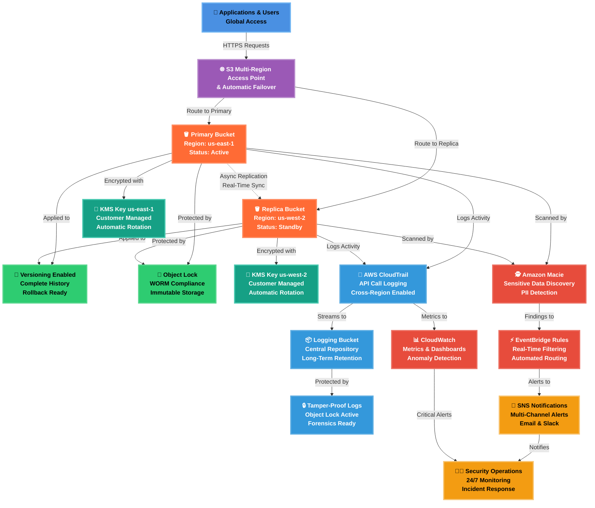

# 🌍 Secure Multi-Region S3 Architecture  
### Cross-Region Replication (CRR) & Multi-Region Access Points (MRAP)

---

## 📑 Table of Contents

---

## 🧭 Description

This project implements a **secure, resilient, and compliance-ready Amazon S3 architecture** using **multi-region design principles** and **event-driven security monitoring**.

The solution combines **KMS-encrypted S3 buckets**, **Object Lock (WORM)**, and **Object Versioning** to protect data against accidental deletion, ransomware, and insider threats. **Cross-Region Replication (CRR)** ensures data durability and disaster recovery, while **Multi-Region Access Points (MRAP)** provide low-latency global access.

Security visibility and automation are enhanced using:
- **Amazon Macie** for sensitive data discovery
- **Amazon EventBridge** for security event routing
- **Amazon SNS** for real-time alerts
- **AWS CloudTrail & CloudWatch** for centralized logging and auditing

This architecture is well-suited for **regulated environments**, **forensics readiness**, and **zero-trust cloud security models**.

---

## 🏗️ Architecture at a Glance
 

| Component | Purpose | Key Features |
|-----------|---------|--------------|
| 👥 **Applications & Users** | Global client access layer | Multi-region routing, automatic failover |
| 🌐 **Multi-Region Access Point** | Intelligent request routing | Latency-based routing, health checks |
| 🪣 **S3 Buckets** | Dual-region storage | Active-passive configuration, CRR enabled |
| 🔄 **Versioning** | Data protection | Point-in-time recovery, accidental deletion protection |
| 🧱 **Object Lock** | Compliance & immutability | WORM storage, ransomware protection |
| 🔐 **KMS Encryption** | Data confidentiality | AES-256 encryption, automated key rotation |
| 🧾 **CloudTrail** | Audit logging | Complete API activity tracking, compliance evidence |
| 📦 **Central Logging** | Log aggregation | Cross-account logging, long-term retention |
| 🕵️ **Amazon Macie** | Data classification | Automated PII detection, sensitive data alerts |
| ⚡ **EventBridge** | Event orchestration | Real-time event filtering, automated workflows |
| 📊 **CloudWatch** | Operational monitoring | Custom metrics, anomaly detection, dashboards |
| 📣 **SNS Notifications** | Alert distribution | Multi-channel delivery, priority routing |
| 👨‍💼 **Security Operations** | Incident response | 24/7 monitoring, threat analysis, remediation |

 

### Architectural Diagram: 

 

---

## 🔐 Security & Resilience Highlights

| Control | MITRE ATT&CK Technique | ID | Security Benefit |
|-------|------------------------|----|------------------|
| 🪣 **Multi-Region S3** | Data from Cloud Storage | T1530 | Prevents data loss via geographic redundancy |
| 🌐 **CRR** | Data Encrypted for Impact | T1486 | Preserves clean copies during ransomware events |
| 🚀 **MRAP** | Network Service Discovery | T1046 | Maintains service availability during regional failures |
| 🔐 **KMS CMKs** | Unsecured Credentials | T1552 | Protects data confidentiality at rest |
| 🧱 **Object Lock (WORM)** | Inhibit System Recovery | T1490 | Prevents deletion or tampering of backups |
| 🔄 **Object Versioning** | Data Destruction | T1485 | Enables rollback after accidental or malicious changes |
| 🧾 **CloudTrail Logging** | Modify Cloud Compute Infrastructure | T1578 | Detects unauthorized configuration changes |
| 📊 **CloudWatch Alerts** | Account Manipulation | T1098 | Flags abnormal access or policy changes |
| 🕵️ **Amazon Macie** | Data from Cloud Storage | T1530 | Identifies sensitive data exposure |
| ⚡ **EventBridge + SNS** | Command and Control | T1105 | Enables near-real-time incident response |

---

## ⚡ Event-Driven Security & Alerting

This architecture leverages **event-driven automation** to detect and respond to security risks in near real time.

**Flow Overview:**

1. **Amazon Macie** scans S3 buckets for sensitive data
2. **Macie findings** are published to **Amazon EventBridge**
3. **EventBridge rules** filter high-severity findings
4. **Amazon SNS** sends alerts to security teams
5. **CloudTrail & CloudWatch** provide investigation context

**Benefits:**
- Faster detection of data exposure
- Reduced mean time to respond (MTTR)
- Centralized, auditable alerting
- SOC-ready security telemetry

---

## ☁️ CloudFormation Stacks

### 📦 JSON Stack #1 – Stand Alone S3 Replica Bucket:

**Description:**  

This CloudFormation template provisions a secure secondary-region S3 replica bucket with Object Lock (WORM), versioning, and KMS encryption to serve as a protected replication destination. It enforces private access, immutable storage, and controlled retention, making it suitable for disaster recovery, ransomware resilience, and compliance-driven data replication.

**Stack Diagram:**  

---

### 📦 JSON Stack #2 - Parent Stack:

**Description:**  
Deploys additional region-specific S3 buckets configured for **CRR**, **Object Lock**, **Versioning**, and **KMS encryption**.

**Stack Diagram:**  

---

### 📦 JSON Stack #3 – Centralized Logging bucket:

**Description:**  
Centralized Logging CloudFormation Stack:
This CloudFormation template deploys a hardened S3 logging bucket with Object Lock (WORM), versioning, and KMS encryption to securely store S3 access logs and CloudTrail events. It enforces private, immutable log retention and integrates with CloudTrail and CloudWatch Logs, providing a tamper-resistant audit trail for security monitoring, forensics, and compliance.

**Stack Diagram:**  

---

### 📦 JSON Stack #4 - Main S3 Bucket:

**Description:**  

**Stack Diagram:**  

---

### 📦 JSON Stack #5 - S3 MRAP:

**Description:**  

**Stack Diagram:**  

---

### 📦 JSON Stack #6 - Eventbridge, Macie & SNS:

**Description:**  

**Stack Diagram:**  

---

### 📦 [JSON Stack #7 - CloudTrail Audit Logging:](stack_7_cloudtrail)
**Description:**  

**Stack Diagram:**  

---

### 📦 JSON Stack #8 OPTIONAL - Config for Intelligent-Tiering:

**Description:**  

**Stack Diagram:**  

---

## ✅ Use Cases

- Ransomware-resistant backups
- Compliance-driven storage (SEC 17a-4, HIPAA, GDPR)
- Global application data access
- Forensics & audit readiness
- Zero-trust cloud architectures

---

## 🛡️ Deployment Script:  

---

## ⚠️ Important Post-Deployment

After parent stack deployment:

- ✅ Confirm email subscription (Stack 6)
- ✅ Update Replica Stack (Stack 1) with ReplicationRole ARN
- ✅ Test CloudTrail
- ✅ Test monitoring alerts

---

## 🛡️ Update Post-Deployment Script:  

